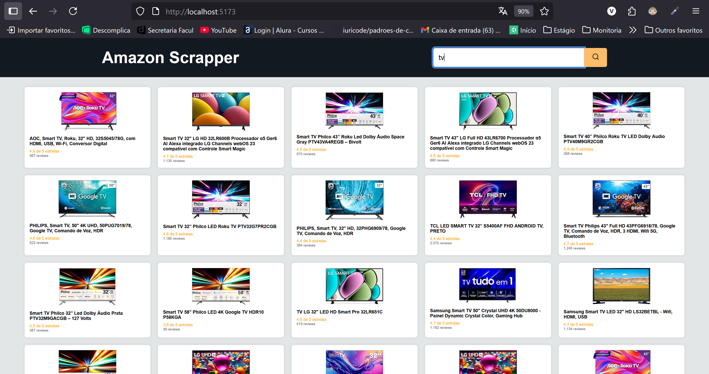

# Amazon Scrapper 🚀

This project was developed as part of a technical challenge. It consists of a full-stack application that collects data from the first page of Amazon results, searching for a user-specified search term (🪒 🎲).

# Main Objective

- Receives a search term via the frontend
- Makes a request to the backend
- The backend scrapes Amazon using `axios` and `jsdom`
- Returns the data for the products found
- Displays the results clearly and stylishly on the frontend

## ⚠️ Technical Observations

Amazon has anti-scraping systems that can block automated requests, even with headers simulating browsers. Therefore, the backend was programmed to return mocked data when the real request fails, ensuring that the frontend remains functional and demonstrable.

This approach allows validation of the entire project structure, including:

- Communication between frontend and backend
- Data manipulation with JSDOM
- Styling and display of results

> ⚠️ I know I left a lot of comments, but I really wanted to leave my reasoning.

# General information

<details>
  <summary><strong>🤷🏽‍♀️ Real-world applicability</strong></summary><br />
    This type of solution can be used for market analysis, price monitoring, product metrics collection, or integration with recommendation systems. Furthermore, the architecture, which separates backend and frontend, facilitates scalability and maintenance, allowing adaptations to different data sources.
</details>

<details>
  <summary><strong>👨‍💻 Base structure</strong></summary><br />
 
        amazon_scraper/
        ├── backend/
        │   ├── src/
        │   │   └── index.ts
        │   └── mocks/
        │       └── tvMocks.ts
        ├── frontend/
        │   ├── index.html
        │   ├── src/
        │   │   ├── main.js
        │   │   └── style.css
        │   └── vite.config.js


</details>

<details>
  <summary><strong>👀 Technologies used:</strong></summary><br />
  1. Back-end:
  <ul>
    <li>Bun,</li>
    <li>Express,</li>
    <li>JSDOM,</li>
    <li>Axios.</li>
  </ul>
  2. Front-end:
  <ul>
    <li>HTML,</li>
    <li>CSS,</li>
    <li>Vanilla JavaScript with Vite.</li>
  </ul>

</details>

<details>
  <summary><strong>🚵 Hard Skills Demonstrated:</strong></summary><br />

 ### 🔧 Backend Development
- **Express.js**: Creating HTTP server and defining RESTful routes.
- **Axios**: Making HTTP requests with custom headers to simulate browser behavior.
- **JSDOM**: Manipulating HTML as a virtual DOM to extract data from web pages.
- **Error Handling**: Using `try/catch` blocks to capture failures and return appropriate responses.
- **CORS**: Configuring cross-origin access policies between frontend and backend.
- **Fallback with Mocks**: Implementing alternative logic to ensure functionality in case of external failure.

### ⚙️ Environment & Tools
- **Bun**: Using a modern runtime for optimized backend development.
- **Vite**: Setting up a fast and lightweight frontend development environment.
- **Development Proxy**: Redirecting API calls via `vite.config.js` to avoid CORS issues.

### 🎨 Frontend Development
- **HTML5 & CSS3**: Semantic page structure and responsive styling.
- **Vanilla JavaScript**: DOM manipulation, event handling, and AJAX requests using `fetch`.
- **Modularization**: Separating responsibilities across HTML, JS, and CSS files.
- **JSON Data Handling**: Dynamically displaying results based on API responses.

</details><br>


# 👀 Guidelines - READ CAREFULLY 👀

<details>
  <summary><strong>⚠️ Before you start using the application</strong></summary><br />

  > ⚠️ Make sure you have already installed [Bun(v1.2.20)](https://bun.com/blog/bun-v1.2.20) and [Node(v22.18.0)](https://nodejs.org/en/blog/release/v22.18.0) on your machine to avoid any incompatibility issues while the application is running.

  1. Clone the repository

  - Use the command: `git clone git@github.com:otaviovcn/amazon_scraper.git`.
  - Enter the repository folder you just cloned:
    - `cd amazon_scraper`

  2. Install Front-end dependencies
  - Open a new terminal and type:
    - `cd frontend && npm install`
  
  3. Install Back-end Dependencies
  - Open a new terminal and type:
    - `cd backend && bun install`

</details>

<details>
  <summary><strong>🛠 How to initialize the application?</strong></summary><br />

  To follow the instructions below, make sure you have completed the previous steps.

<strong>To run the interface (front-end)</strong>

- Open a new terminal and enter the following command:

  ```bash
  $ cd frontend && npm run dev
  ```

<strong>To run the server (back-end)</strong>

- Open a new terminal and enter the following command:

  ```bash
  $ cd backend && npm start
  ```  
</details><br/>

# 💡Future Improvements

- Limit product titles for better framing

- Implement results pagination

- Add automated testing

- Improve responsiveness


# Funcional Print


